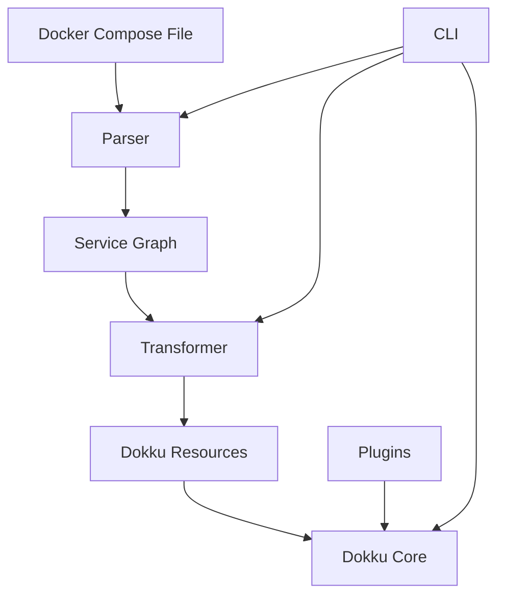

# Dokku Docker Compose Plugin Architecture

## Overview

This document describes the architecture of the Dokku Docker Compose plugin, which enables importing Docker Compose files into Dokku while maintaining compatibility with existing Dokku plugins and features.

## High-Level Architecture

## Core Components

### 1. Parser
- **Responsibility**: Parse and validate Docker Compose files
- **Input**: `docker-compose.yml` (v2/v3)
- **Output**: Normalized service definitions
- **Features**:
  - YAML parsing with schema validation
  - Environment variable interpolation
  - Extension point for custom validators

### 2. Service Graph
- **Responsibility**: Model service dependencies and relationships
- **Components**:
  - Dependency resolver
  - Cycle detection
  - Topological sorter
- **Features**:
  - Builds directed acyclic graph (DAG) of services
  - Determines execution order
  - Identifies independent services for parallel processing

### 3. Transformer
- **Responsibility**: Convert Docker Compose concepts to Dokku resources
- **Components**:
  - Resource mappers (networks, volumes, etc.)
  - Plugin detector
  - Environment variable processor
- **Features**:
  - Handles Docker-specific configurations
  - Integrates with Dokku plugins
  - Manages resource naming and references

### 4. Executor
- **Responsibility**: Coordinate the creation/update of Dokku resources
- **Components**:
  - Operation planner
  - Dependency manager
  - Rollback handler
- **Features**:
  - Transactional updates
  - Parallel execution where possible
  - Automatic rollback on failure

## Data Flow

1. **Initialization**:
   - Load and parse `docker-compose.yml`
   - Resolve environment variables
   - Validate against schema

2. **Analysis**:
   - Build service dependency graph
   - Detect plugin integrations
   - Plan operations

3. **Execution**:
   - Create/update resources in dependency order
   - Handle plugin integrations
   - Configure networking and storage

4. **Verification**:
   - Run health checks
   - Verify service availability
   - Perform post-deployment tasks

## Key Design Decisions

### 1. Plugin Integration
- **Approach**: Use Dokku's plugin system for service management
- **Rationale**: Leverage existing, well-tested implementations
- **Implementation**:
  - Detect compatible plugins based on image names
  - Map Docker Compose configurations to plugin commands
  - Fall back to container-based deployment when no plugin is available

### 2. State Management
- **Approach**: Store minimal state in Dokku's configuration
- **Rationale**: Ensure consistency and enable recovery
- **Implementation**:
  - Store original compose file checksum
  - Track resource mappings
  - Maintain version history

### 3. Error Handling
- **Approach**: Fail fast with clear error messages
- **Rationale**: Prevent partial or inconsistent states
- **Implementation**:
  - Input validation
  - Pre-flight checks
  - Transactional updates with rollback

## Integration Points

### Dokku Core
- App management
- Network configuration
- Volume management
- Process management

### External Systems
- Docker Registry (for image pulls)
- Docker Daemon (for container operations)
- System Package Manager (for plugin installation)

## Security Considerations

1. **Input Validation**:
   - Sanitize all inputs
   - Validate against schema
   - Restrict file system access

2. **Secret Management**:
   - Handle environment variables securely
   - Support Dokku's secret management
   - Avoid logging sensitive data

3. **Access Control**:
   - Respect file permissions
   - Run with least privilege
   - Validate user permissions

## Performance Considerations

1. **Parallel Processing**:
   - Process independent services concurrently
   - Limit concurrency to prevent resource exhaustion

2. **Caching**:
   - Cache parsed compose files
   - Store intermediate build artifacts

3. **Optimizations**:
   - Lazy loading of resources
   - Incremental updates
   - Batch operations where possible

## Monitoring and Observability

1. **Logging**:
   - Structured logging
   - Different log levels
   - Operation context

2. **Metrics**:
   - Operation duration
   - Resource usage
   - Success/failure rates

3. **Tracing**:
   - Request tracing
   - Dependency tracking
   - Performance analysis

## Future Extensions

1. **Plugin System**:
   - Custom transformers
   - Additional validators
   - Post-processing hooks

2. **Export Functionality**:
   - Generate compose files from existing Dokku apps
   - Support for different output formats

3. **Advanced Features**:
   - Blue/green deployments
   - Canary releases
   - A/B testing support
